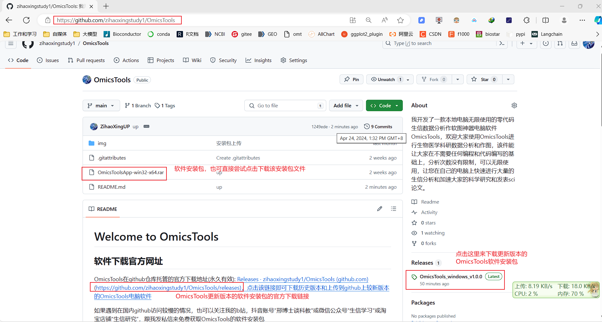
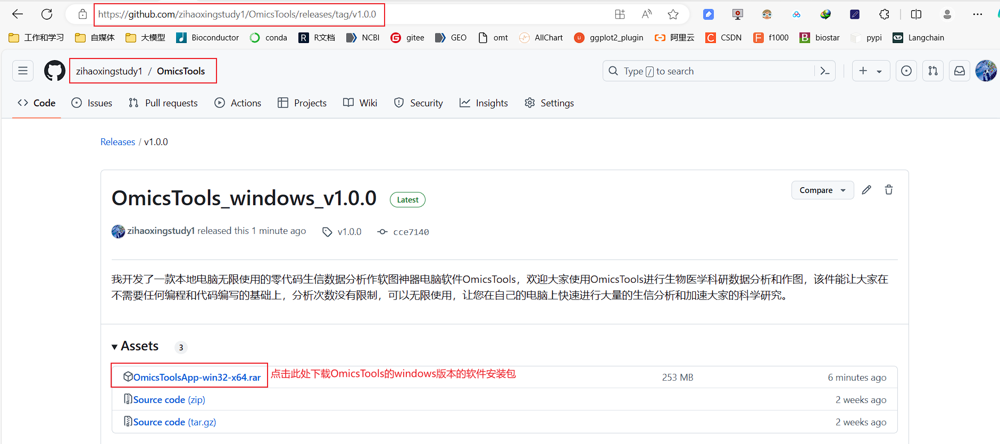
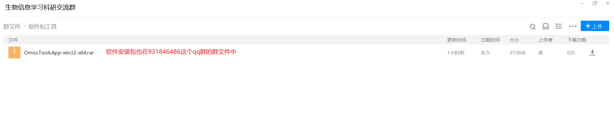

# Welcome to OmicsTools

## 软件简介

我开发了一款本地电脑无限使用的零代码生信数据分析作软图神器电脑软件OmicsTools，欢迎大家使用OmicsTools进行生物医学科研数据分析和作图，该软件件能让大家在不需要任何编程和代码编写的基础上，分析次数没有限制，可以无限使用，让您在自己的电脑上快速进行大量的生信分析和加速大家的科学研究。

目前市面上各种云平台网站上的各种组学分析，GEO/TCGA数据挖掘，各种复杂图形作图，单细胞数据分析，WGCNA, ssGSEA、GSVA, 拟时序分析， 细胞通讯，机器学习人工智能构建临床预后模型等高级复杂个性化分析都是按次收费的，一次最低都要好几百，在OmicsTools这里都是可以在你自己的电脑上无限使用无限分析的，没有次数限制，一次收费，无限使用，收费也是全网最低价，性价比最高的。

OmicsTools支持申请免费试用，大家可以通过关注和预约我的在线教学直播来了解OmicsTools具备的功能，我给大家现场直播,我也在微信公众号"生信学习",b站抖音小红书"邢博士谈科教"等自媒体平台发布了很多关于OmicsTools的图文教程和视频教程，大家可以前往这些平台关注我的账号和浏览我发布的作品对OmicsTools有更多的了解，我觉得OmicsTools功能是非常丰富强大的，肯定是能让大家满意的。

OmicsTools当前比很多按次收费的云平台都要强大很多，OmicsTools是可以无限使用的，没有次数限制，分析功能也特别多，全部都是零代码操作，一学就会，简单好用。

你会发现用我开发的软件，让你短时间内就成为生信大神，啥都会做，自己编程摸爬滚打，各种报错，花了几个月或者几年，掌握的分析技能还没有我软件能做的分析多。

## OmicsTools涵盖的功能和愿景

### 热门公共数据库数据的下载和挖掘

* GEO数据库各种GSE数据集的下载和分析
* TCGA和ICGC癌症多组学数据的下载和分析
* CPTAC临床蛋白组多组学数据的下载和分析
* ProteomeXchange蛋白组学质谱数据的下载和分析

### 涵盖的各种生信分析模块和工具

* 基因芯片和RNAseq数据分析
* 质谱蛋白组学和代谢组学数据分析
* 突变和拷贝数变异数据分析和孟德尔随机化分析
* chipseq,ATACseq等基因调控数据分析
* DNA甲基化和蛋白翻译后修饰数据分析
* 单细胞组学和空间转录组学数据分析
* 各种常用的数据清洗质控和绘图可视化模块
* 各种数据统计分析和机器学习数据挖掘模块

### OmicsTools的优势

* OmicsTools集成了大量的生信数据分析和作图可视化模块和工具
* OmicsTools所有的模块工具都是零代码不需要编程基础即可操作
* OmicsTools在本地个人电脑分析，不会把数据上传到分析网站存在的数据泄露问题
* OmicsTools在本地分析，用户可以无限分析，没有次数限制
* OmicsTools可以让用户利用各个模块串联起来实现复杂的科研课题分析
* OmicsTools对于国产生物软件的发展和自主可控有所贡献
* OmisTools的每个功能模块都制作了详细的图文和视频教学课程和结果解读，让大家能快速掌握OmicsTools的使用和进行各种复杂的生信分析和作图

## OmicsTools的软件安装包下载安装配置使用操作详解

### OmicsTools的软件包下载教程详解

* [OmicsTools软件的官方github地址](https://github.com/zihaoxingstudy1/OmicsTools): https://github.com/zihaoxingstudy1/OmicsTools
* [OmicsTools软件的更新版本的下载地址](https://github.com/zihaoxingstudy1/OmicsTools/releases):https://github.com/zihaoxingstudy1/OmicsTools/releases

也可以在我的生信学习交流群931846486的群文件中下载该软件安装包

如果遇到在国内github访问较慢的情况，也可以关注我的b站，抖音，小红书账号"邢博士谈科教"或微信公众号"生信学习"或淘宝店铺“生信研究”，跟我发私信来免费获取OmicsTools的软件安装包，软件安装包也在我的生信学习交流qq群931846486的群文件中和b站的粉丝应援团里。
平时软件更新都比较频繁，大家可以到我的zihaoxingstudy1/OmicsTools github仓库,qq群931846486的群文件中和b站的粉丝应援团里获取添加了更多分析功能的最新的OmicsTools软件包。

### OmicsTools的安装配置教程详解

可以到我的b站上观看OmicsTools的非常详细易懂的安装配置教学视频

* b站上OmicsTools的官方介绍视频:https://www.bilibili.com/video/av1201662576/
* b站上OmicsTools的安装配置视频: https://www.bilibili.com/video/BV1hx42117U4/ 

## OmicsTools软件用户关心的问题答疑

### 软件会一直更新添加新的功能吗，怎么获取新版本的OmicsTools?

软件是一直都在更新，而且是永久更新的，而且更新非常频繁，一般至少每个月都会更新一般OmicsTools并添加更多新的功能进来，我更新的在本地电脑无限使用无限分析作图的生信零代码一键分析电脑软件神器OmicsTools新版本软件下载github官方网址: https://github.com/zihaoxingstudy1/OmicsTools ，也可以到我的生信交流qq群931846486的群文件中或b站粉丝应援团中下载到OmicsTools分析软件,大家可以下载安装OmicsTools进行各种生信分析和可视化作图。

### 如何能免费使用OmicsTools的各种分析和作图功能?

可以点击该报名接龙链接进入会员免费使用权限的报名申请接龙，直接填上你的名字接龙一下即可。【腾讯文档】OmicsTools免费试用申请报名接龙，满 100 人后开通试用权限和一晚上直播教学
https://docs.qq.com/form/page/sequence/DWXJEeGtscVlDb0xu

大家可以把我发布的任意跟OmicsTools相关的文章或视频转发到你的朋友圈或者群聊中，然后截图发我微信上,
，我拉大家到我的生信学习交流的qq群,大家在我的qq群里进行OmicsTools免费试用申请报名接龙和现场直播教学答疑，预约OmicsTools试用报名用户满100人后我就给这100名试用用户开通会员权限同时在抖音上开播跟大家免费讲解一晚上的OmicsTools的安装配置和使用教程和各种答疑解惑。

大家可以多转发给你的好友加速预约满100人开播时间的到来，等预约满100人后，我会马上帮预约我直播的OmicsTools试用用户开通48小时的OmicsTools试用权限。
预约满100人后我会在晚上的9:30-11:30直播给大家免费教学一个晚上，欢迎大家在看我直播的时候，跟我语音连麦，视频连麦，也可以把你们的电脑屏幕共享给我，我能看到你们电脑上实时的OmicsTools运行情况，这样可以把在线教学的效果最大化，也能在短时间内解决更多人的问题。

目前市面上各种云平台网站上的各种组学分析，GEO/TCGA数据挖掘，各种复杂图形作图，单细胞数据分析，WGCNA, ssGSEA、GSVA, 拟时序分析， 细胞通讯，机器学习人工智能构建临床预后模型等高级复杂个性化分析都是按次收费的，一次最低都要好几百，在OmicsTools这里都是可以在你自己的电脑上无限使用无限分析的，没有次数限制，一次收费，无限使用，收费也是全网最低价，性价比最高的。

### 如何能找到OmicsTools相关的图文和视频教程?

我在抖音，b站，小红书等全网自媒体"邢博士谈科教"和微信公众号"生信学习"中都有更新一些OmicsTools使用的相关图文和视频教程，大家可以关注我的自媒体账号和观看我发布的一些作品，目前在微信公众号和b站更新的会更全一些。

### OmicsTools的详细收费价格是怎样的？

OmicsTools提供短期年费会员和长期永久终身会员两种付费模式，软件年费会员:500元/年,购买后可在自己电脑上一年内无限使用(短期年费会员每人只能购买一次);软件终身永久大会员:1499元,购买后可在自己电脑上永久无限使用。

OmicsTools的会员购买和付费服务可向我的微信zxhya_123进行微信转账购买，我近期也在淘宝上上架了该产品,大家也可关注我的淘宝店铺"生信研究"并通过该淘宝链接： https://s.click.taobao.com/amaPfot  来购买我的OmicsTools软件会员授权等服务。

OmicsTools支持申请免费试用，大家可以通过关注和预约我的在线教学直播来了解OmicsTools具备的功能，我给大家现场直播,我也在微信公众号"生信学习",b站抖音小红书"邢博士谈科教"等自媒体平台发布了很多关于OmicsTools的图文教程和视频教程，大家可以前往这些平台关注我的账号和浏览我发布的作品对OmicsTools有更多的了解，我觉得OmicsTools功能是非常丰富强大的，肯定是能让大家满意的。

OmicsTools当前比很多按次收费的云平台都要强大很多，OmicsTools是可以无限使用的，没有次数限制，分析功能也特别多，全部都是零代码操作，一学就会，简单好用，你会发现用我开发的软件，让你短时间内就成为生信大神，啥都会做，自己编程摸爬滚打，各种报错，花了几个月或者几年，掌握的分析技能还没有我软件能做的分析多。

### 如何得到那8个GB的已经被我编译安装好的开箱即用的所有R包网盘链接

这8个GB的已经被我编译安装好的开箱即用的所有R包网盘链接是非常有用的，即使你没用OmicsTools,你把这个网盘中的R包都下载解压到你的电脑上，就能自动使用安装安装包，能帮你节省很多时间，解决很多R包安装失败和安装报错的问题。

对于支付了500元年费会员和1499元永久会员的朋友，可以免费得到这8个GB的R包下载链接。能解决所有即使不用OmicsTools的R语言用户，把这个R包的网盘链接下载解压到你的电脑上也能解决大多数的R包安装报错问题。

首先OmicsTools本身也有自动下载安装R包的功能，但是很多R包的下载链接都是来自国外的服务器，尤其是github平台这些托管在国外服务器上的R包对于中国大陆用户可能会存在下载比较慢，下载不完整，依赖的R包下载不了，导致很多R语言用户经常出现R包安装失败和安装报错的问题，我很多年前就经常接一些付费帮忙解决R包安装报错和付费安装R包的单子。

现在，我把我当前所有可能用到的R包全部都安装好了并克隆了一份，这些R包有将近800个，总体积接近8个GB，我会把这些R包打包上传到网盘中，大家付费50块钱就可以把这些R包的网盘链接发给大家，这8个GB的R包可以解决绝大多数人的R包安装报错问题和R包安装不上的问题，即使没有用OmicsTools的朋友，只要在用R语言，这8个GB的R包都是非常有用的，我也通过这8个GB的R包帮助很多非OmicsTools用户解决了大量R包安装报错和安装不上的问题，这些朋友也都有付费给我。在闲鱼淘宝上也有大量提供R包安装和报错解决的商家，他们的报价也都远不止这50块钱。

没有购买OmicsTools的用户，这8个GB的R包也非常有用，想要的朋友可以在淘宝上:https://s.click.taobao.com/amaPfot下单50元即可购买的到。

### 如何得到OmicsTools大量重要数据集的演示数据文件?

对于支付了500元年费会员和1499元永久会员的朋友，可以免费得到这些重要数据集的网盘文件。

首先OmicsTools本身也有很多生信分析功能不需要演示数据也能运行，但是生信分析很多都是要基于数据来分析的，OmicsTools也用到了很多的演示数据文件，我的这些演示数据文件都是特别重要和有意义的，包括了很多重要的通路基因集，基因组注释数据，单细胞的很多细胞marker基因集，药物用药数据库信息等，这些演示文件也有很多个GB,体量非常大，很多文件都非常有用，在其它很多人或者闲鱼淘宝上这些数据的数据文件也都是要付费购买的，当前很多朋友自己有数据也都是可以直接把数据放到OmicsTools上分析的。

### OmicsTools做不做生信教学培训，收费也是像当前市面上众多收费好几千的生信培训班一样吗？

OmicsTools也做生信教学培训班训练营，提供的生信分析技能比很多培训班都多很多，有信心让大家在短时间内就掌握几百个生信分析技能。OmicsTools提供的生信分析技能教学培训班训练营价格: 999元，向学员在线培训软件所有模块和工具的使用，以及把大量模块串联起来进行复杂的科研课题分析,每晚培训1小时，培训1个月共30小时。
也可以按小时收费来培训大家做各种生信分析,一对多生信培训每小时收费50元,一对一生信教学培训每小时收费100元,比大多数家教便宜，也比大多数收费好几千的生信培训班也便宜的多,基本上是全网最低价了。

### 可以通过哪些途径购买到OmicsTools会员，OmicsTools全套R包，全套演示数据, 一对一生信教学，一对多生信教学培训，个性化生信分析等更多的付费服务？

OmicsTools的会员购买和付费服务可向我的微信zxhya_123进行微信转账购买，我近期也在淘宝上上架了该产品,大家也可关注我的淘宝店铺"生信研究"并通过该淘宝链接： https://s.click.taobao.com/amaPfot  来购买我的OmicsTools软件会员授权等服务。

  

  

